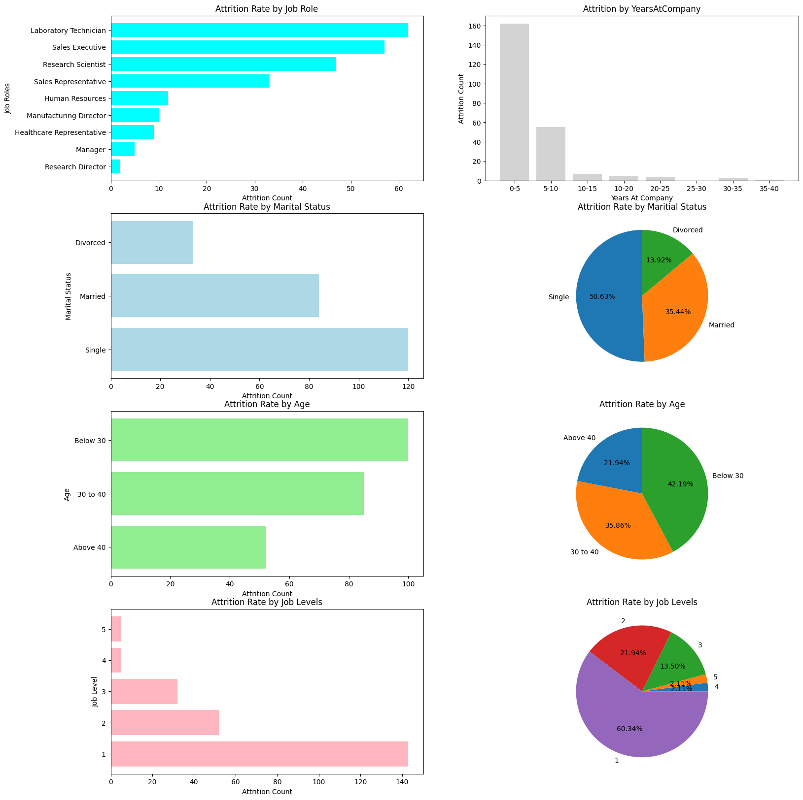

# HR Employee Attrition Data Analysis

Welcome to the **HR Employee Attrition Data Analysis** project!  
This repository contains a comprehensive analysis of HR data to understand the factors contributing to employee attrition. The project leverages data science techniques to uncover insights and provide actionable recommendations to reduce attrition rates and improve employee retention.

## 📊 Project Overview

Employee attrition, also known as employee turnover, is a critical issue for organizations as it leads to increased recruitment costs, loss of organizational knowledge, and potential disruption of business operations.  
This project aims to analyze HR datasets to:

- Identify key factors influencing employee attrition
- Visualize trends and patterns in attrition
- Build predictive models to estimate attrition risk
- Recommend strategies to reduce attrition

## 🗃️ Data Description

The dataset typically includes the following features:

- **Employee Information**: Age, Gender, Marital Status, Department, Job Role, Education, etc.
- **Work-Related Attributes**: Years at Company, Job Satisfaction, Environment Satisfaction, Work-Life Balance, Overtime, etc.
- **Compensation**: Monthly Income, Percent Salary Hike, Stock Option Level, etc.
- **Performance Metrics**: Performance Rating, Training Times Last Year, etc.
- **Attrition Label**: Whether the employee has left the company (Yes/No)

> *Note: The actual dataset used in this project is included in the repository (or specify source if external).*

## 📈 Analysis & Methodology

1. **Exploratory Data Analysis (EDA):**
   - Descriptive statistics
   - Visualization of attrition distribution and feature relationships
   - Correlation analysis

2. **Data Preprocessing:**
   - Handling missing values
   - Encoding categorical features
   - Feature scaling

3. **Insights & Recommendations:**
   - Identification of top attrition drivers
   - Actionable HR recommendations based on findings

## 🖼️ Sample Visualizations

 

## 📈 Insights & Recommendations:

  1. Focus on High-Risk Roles: Prioritize retention strategies for Laboratory Technicians, Sales Executives, and Research Scientists.
  2. Support Young Employees: Employees under 30 are leaving more—offer mentorship, career growth, and engagement programs.
  3. Improve Compensation: Review salary structures; employees who left earned significantly less on average.
  4. Engage Single Employees: Singles are more likely to leave—create inclusive social and support programs.
  5. Monitor Promotions: Employees promoted recently tend to leave—ensure post-promotion support and recognition.
  6. Address Job Satisfaction: Satisfaction levels 1 and 3 show higher attrition—conduct feedback sessions and improve role clarity.
  7. Gender-Specific Retention: Male attrition is higher—explore gender-based engagement strategies.
  8. Target Level 1 Employees: Provide growth paths and skill development for entry-level staff.
  9. R&D & Sales Focus: These departments have highest attrition—tailor retention plans accordingly.
  10. Income & Tenure Risk Zone: Employees earning ₹2000–₹8000 and with 0–10 years tenure need focused retention efforts.

## 🚀 Getting Started

1. **Clone the repository:**
   ```bash
   git clone https://github.com/LoganathanR03/HR-Employee-Attrition.git
   cd HR-Employee-Attrition
   ```

2. **Install dependencies:**
   ```bash
   pip install -r requirements.txt
   ```

3. **Run the analysis:**
   - Open Jupyter notebooks in the `notebooks/` directory
   - Or run scripts from the `src/` directory

## 🤝 Contributing

Contributions are welcome!  
Feel free to open issues, submit pull requests, or suggest new features and improvements.

## 📝 License

This project is licensed under the [MIT License](LICENSE).

---

**Author:** [Loganathan R](https://github.com/LoganathanR03)  
For questions or feedback, please open an issue or contact via GitHub.
